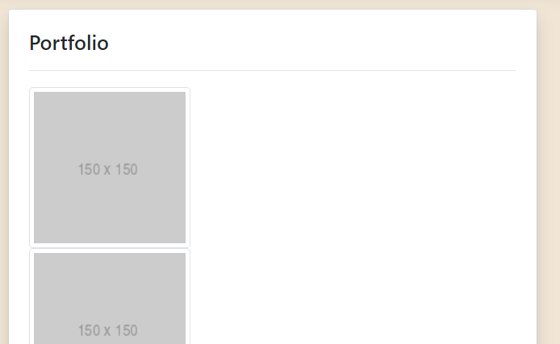
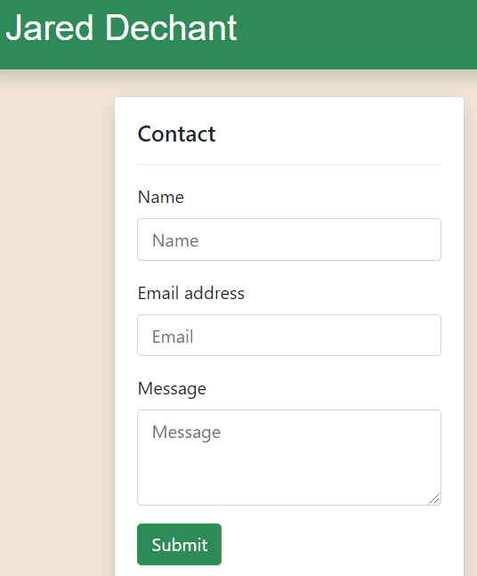
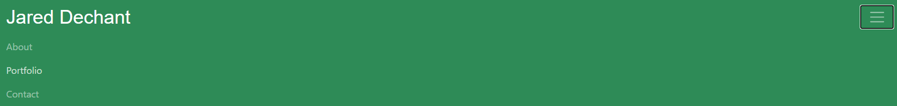

# Responsive Portfolio
URL of deployed application:

https://jar-codes.github.io/02_Responsive_Portfolio/

## Description
This project was both practice with website content and styling. This page utilizes Bootstrap for a responsive design and components. This project is also a foundation for an electronic portfolio that I can use to showcase my skills.
  

